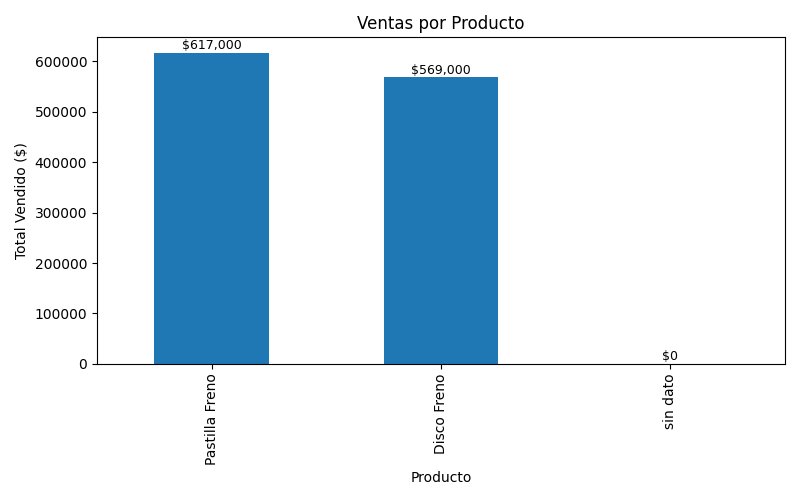
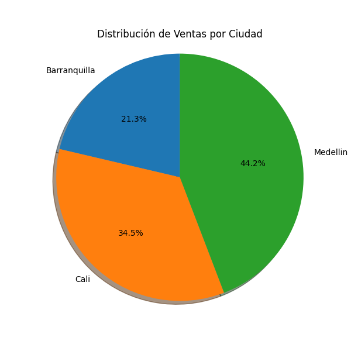

# 🧼 Proyecto de Limpieza de Datos en Excel con Python

Este proyecto demuestra un flujo completo de limpieza de un archivo Excel sucio utilizando Python, incluyendo estandarización de texto, fechas, exportación profesional y visualización de datos. Todo está documentado paso a paso como guía profesional de buenas prácticas.

---

## 📁 Estructura del proyecto

```
practica_python/
├── limpieza_datos.py         # Script principal de limpieza
├── utils.py                  # Función personalizada para fechas robustas
├── ventas_sucias.xlsx        # Archivo original sucio
├── output/
│   ├── ventas_limpias.xlsx           # Archivo limpio exportado
│   ├── grafico_ventas_por_producto.png
│   └── grafico_torta_ventas_ciudad.png
├── paquetes.txt              # Librerías requeridas
```

---

## ✅ ¿Qué se trabajó en este proyecto?

- Lectura de archivo Excel con pandas
- Limpieza de columnas de texto (mayúsculas, acentos, espacios)
- Conversión robusta de fechas con una función personalizada
- Reemplazo de nulos y cálculo de columnas derivadas (`total`)
- Exportación profesional a Excel
- Gráficas en matplotlib: barras y torta
- Buenas prácticas de código y reutilización

---

## 🧽 Limpieza avanzada de texto

```python
from unidecode import unidecode

df['columna'] = df['columna']    .str.strip()    .str.lower()    .apply(lambda x: unidecode(x) if isinstance(x, str) else x)    .str.replace(r'\s+', ' ', regex=True)    .str.title()  # Opcional: capitaliza la primera letra de cada palabra
```

### ¿Qué hace cada función?

| Método | Descripción |
|--------|-------------|
| `.str.strip()` | Elimina espacios al inicio y al final |
| `.str.lower()` | Convierte todo a minúsculas |
| `.str.upper()` | Convierte todo a mayúsculas |
| `.str.title()` | Primera letra de cada palabra en mayúscula |
| `unidecode()` | Elimina tildes/acentos (`Medellín` → `Medellin`) |
| `.replace(r'\s+', ' ', regex=True)` | Reemplaza múltiples espacios por uno solo |

---

## 📆 Conversión robusta de fechas

En lugar de usar `pd.to_datetime()` directamente, se implementó una función personalizada en `utils.py`:

```python
# utils.py
from unidecode import unidecode
import pandas as pd
import re

def convertir_fecha(valor):
    try:
        if isinstance(valor, (int, float)):
            return pd.to_datetime('1899-12-30') + pd.to_timedelta(valor, unit='D')
        elif isinstance(valor, str):
            valor = re.sub(r"[^\d/]", "", valor.strip())
            return pd.to_datetime(valor, dayfirst=True, errors='coerce')
    except:
        return pd.NaT
```

### 🔁 ¿Cómo se usa en el script principal?

```python
from utils import convertir_fecha

df['fecha'] = df['fecha'].apply(convertir_fecha)
```

✅ Esta función corrige fechas mezcladas, con formato inconsistente o como número de Excel. Es la opción más segura para entornos reales.

---

## 📊 Visualización de datos

Se crearon dos gráficas con `matplotlib`:

### 📌 1. Gráfico de barras – Ventas por producto

```python
ventas_por_producto = df.groupby('producto')['total'].sum().sort_values(ascending=False)
ax = ventas_por_producto.plot(kind='bar')
for i, valor in enumerate(ventas_por_producto):
    plt.text(i, valor + 1000, f"${int(valor):,}", ha='center')
```

### 📌 2. Gráfico de torta – Participación por ciudad

```python
ventas_por_ciudad = df.groupby('ciudad')['total'].sum()
plt.pie(ventas_por_ciudad, labels=ventas_por_ciudad.index, autopct='%1.1f%%')
```

Ambas gráficas se guardan como imagen `.png` en la carpeta `/graficas`.

---

## 📦 Librerías utilizadas

Listado en `paquetes.txt`, generado con:

```bash
pip freeze > paquetes.txt
```

Principales:
- `pandas`
- `openpyxl`
- `matplotlib`
- `unidecode`
- `re`

---

---

## 🔎 Tratamiento de valores faltantes

Durante el proceso de limpieza se identificaron valores faltantes en columnas clave como `producto` y `canal`. En lugar de eliminar esos registros (lo que podría generar pérdida de información), se optó por:

- Reemplazar los valores nulos en `producto` o `canal` por `"sin dato"`

Esto permite:

✅ Conservar los registros para análisis posterior  
✅ Visualizar en gráficas la existencia de datos incompletos  
✅ Consultar al área responsable por qué no se registraron correctamente  
✅ Mantener la trazabilidad del dato sin falsificarlo

> 🔔 **Ejemplo:**  
> En el gráfico de barras por producto aparece la categoría “sin dato”. Esta se refiere a registros donde no se diligenció el nombre del producto. En un entorno real, esto sería reportado a operaciones o sistemas para corregir la fuente.

---

### 📊 Gráfico de Barras – Ventas por Producto



### 🥧 Gráfico de Torta – Distribución por Ciudad


## 📝 Conclusiones

- La mayor participación de ventas corresponde a Medellín (44.2%)
- “Pastilla Freno” es el producto más vendido, seguido por “Disco Freno”
- Hay registros sin categoría (“sin dato”) que requieren revisión por parte del área de origen

## 👨‍💻 Autor

Héctor Alejandro Gaviria  
📁 Portafolio profesional: [GitHub](https://github.com/agaviria-analytics)

---
